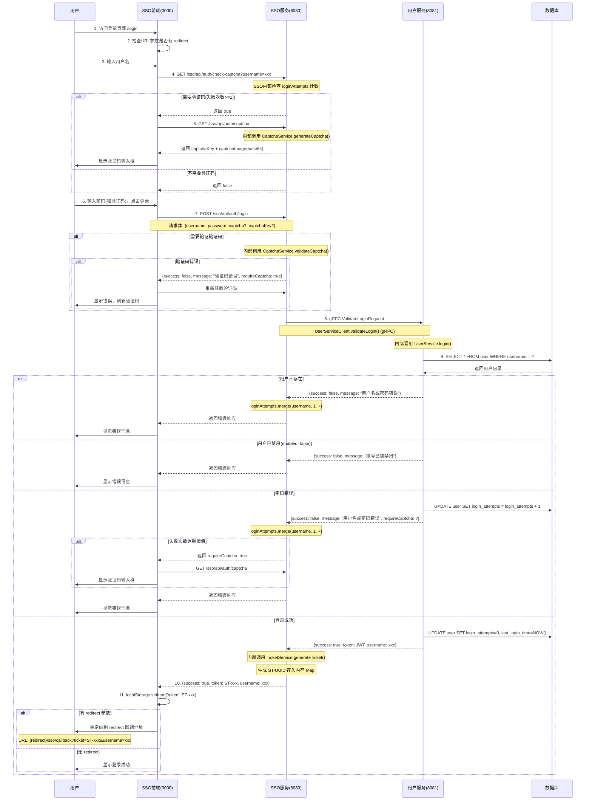
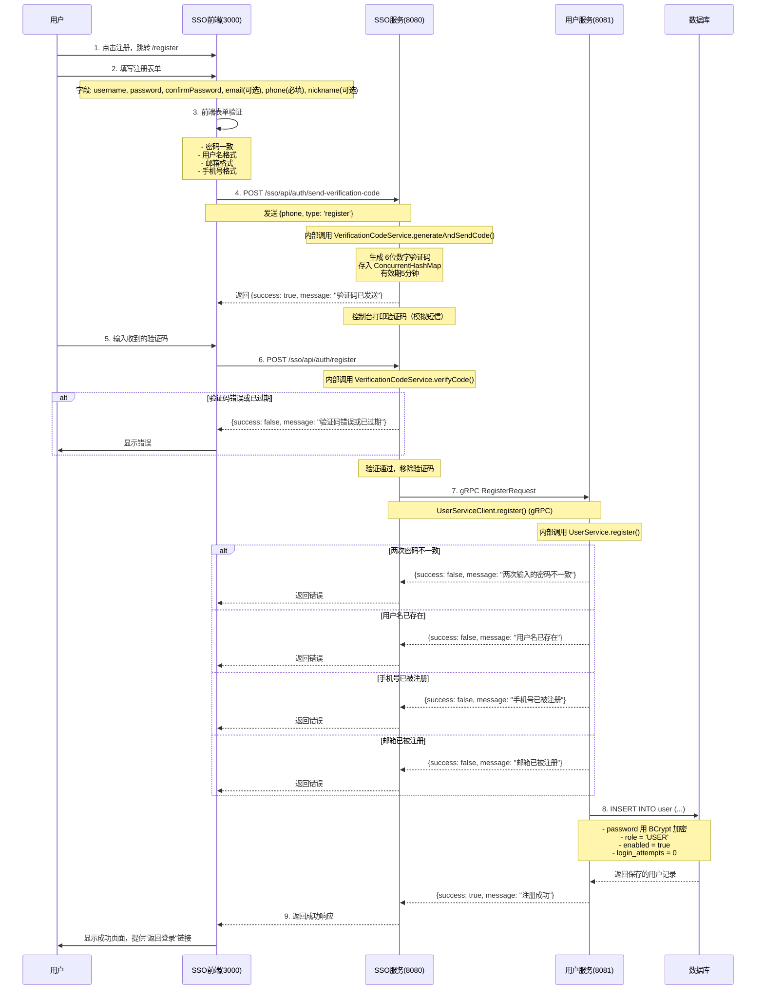
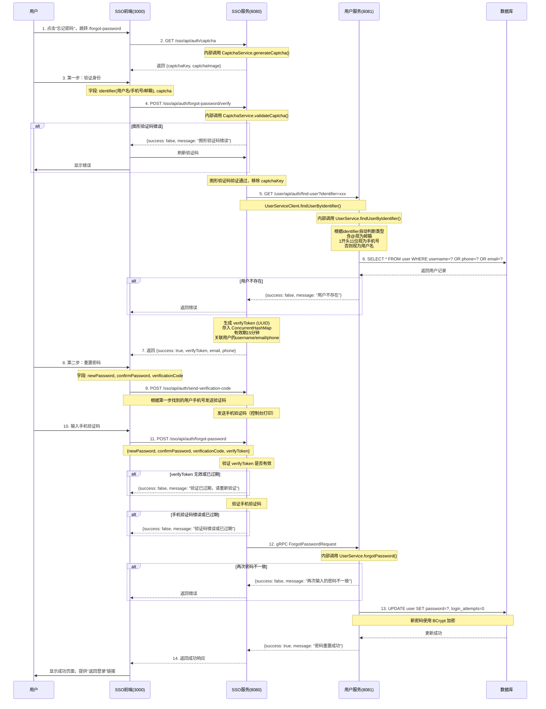
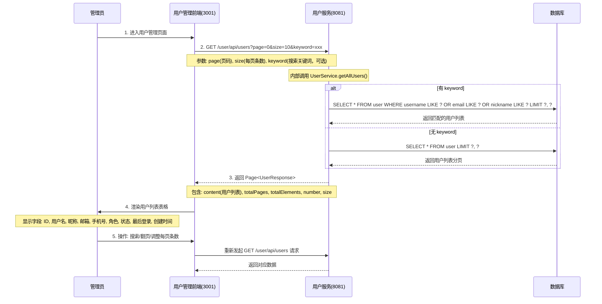
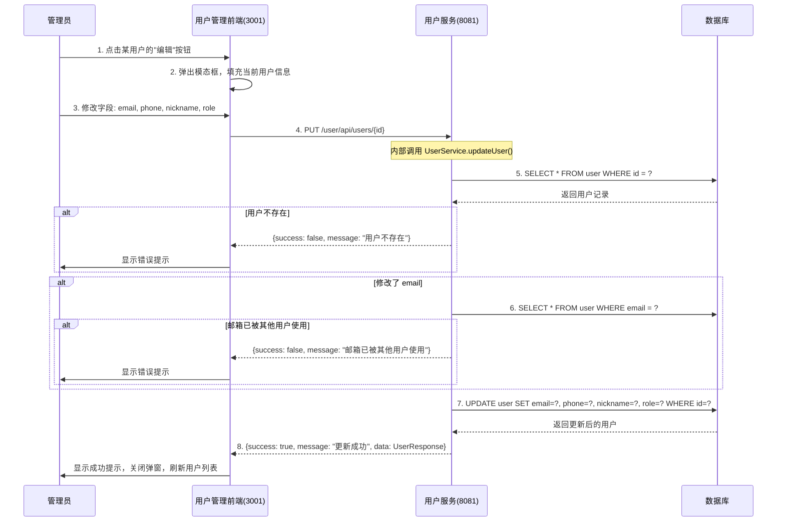
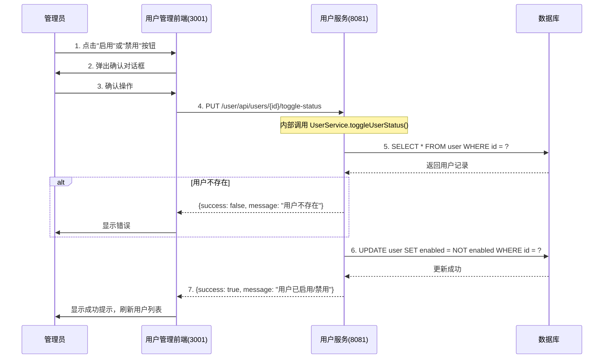
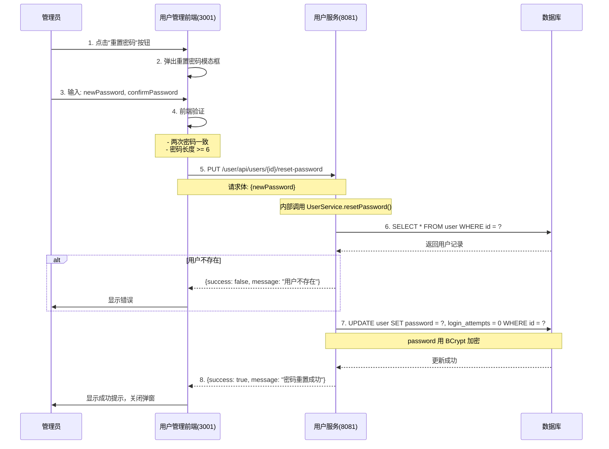
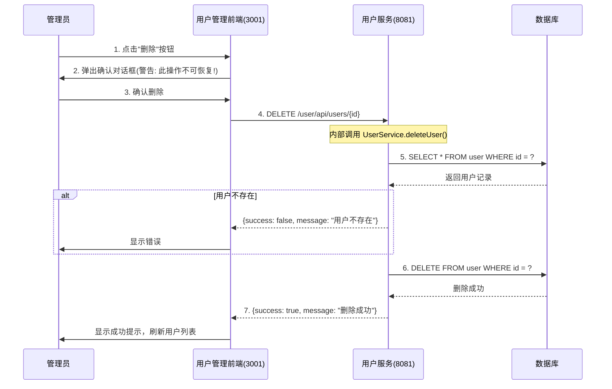
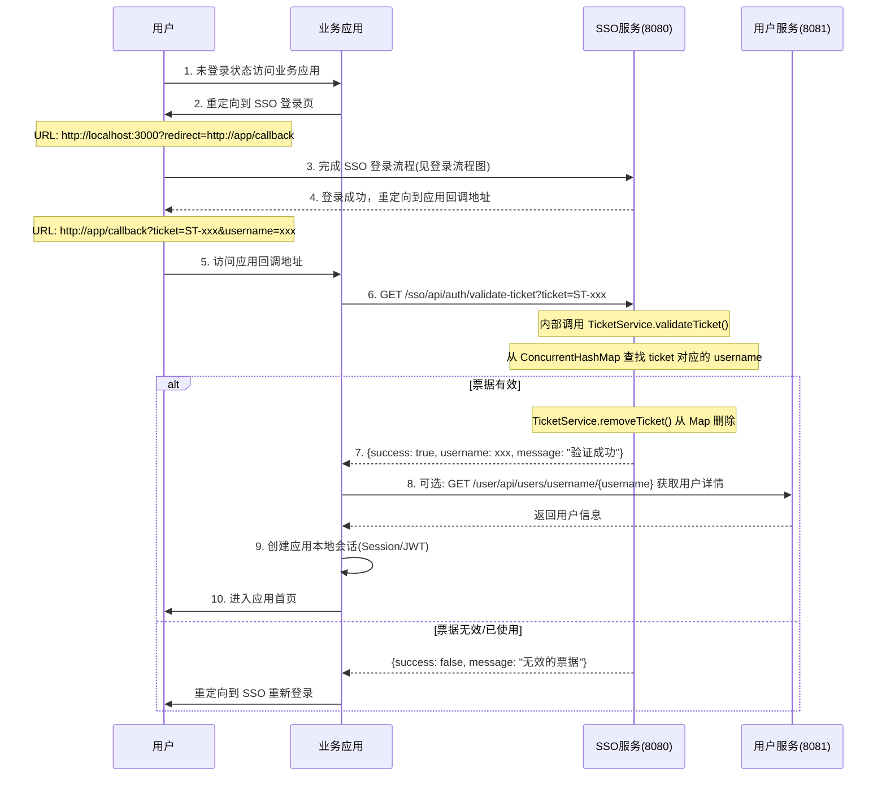
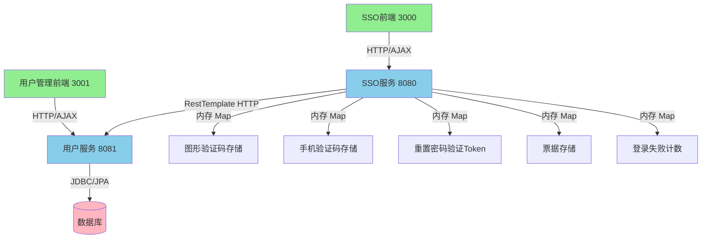

# SSO 单点登录系统 - 真实业务流程文档

## 系统架构概述（v4.0 - APISIX 网关版）

本系统采用前后端分离、轻量化微服务架构，使用 APISIX 网关 + gRPC 服务间通信：

### 前端应用
- **SSO 认证前端 (sso-web)**: 端口 3000，React 应用，提供登录、注册、忘记密码页面
- **用户管理前端 (user-web)**: 端口 3031，React 应用，提供用户管理功能

### 后端服务
- **SSO 认证服务 (sso-server)**: HTTP 端口 8080，gRPC 端口 9090，Spring Boot 应用
  - 内部组件: AuthService, CaptchaService, TicketService, UserServiceClient (gRPC)
  - 负责: 登录认证、注册转发、密码重置转发、验证码生成、票据管理
  
- **用户服务 (user-server)**: HTTP 端口 8081，gRPC 端口 9091，Spring Boot 应用
  - 内部组件: UserService, CaptchaService, JwtUtil
  - 负责: 用户数据管理、密码验证、用户CRUD操作

### 基础设施
- **APISIX 网关**: 端口 80，路由转发、HTTP 代理
- **etcd**: 端口 2379，APISIX 配置存储

### 数据存储
- **数据库 (DB)**: 用户数据持久化存储（H2 内存数据库）
- **内存存储**: ConcurrentHashMap 用于验证码、票据、登录失败次数（服务内部）

---

## 1. SSO 登录流程（真实数据流）

### 流程图 (Mermaid)



### 真实核心要点

1. **验证码机制**:
   - CaptchaService 是 sso-server 内部的 Service 类，不是独立服务
   - 验证码存储在 sso-server 内存的 ConcurrentHashMap
   - 验证成功后立即删除 key（一次性使用）

2. **登录失败计数**:
   - sso-server 和 user-server 各维护一份登录失败计数
   - sso-server: ConcurrentHashMap 内存存储
   - user-server: 数据库 user 表的 login_attempts 字段

3. **服务间调用**:
   - sso-server 通过 UserServiceClient + gRPC 调用 user-server
   - gRPC 地址: `static://user-server:9091` (Docker) 或 `static://localhost:9091` (开发环境)

4. **票据机制**:
   - TicketService 是 sso-server 内部的 Service 类
   - 票据格式: `ST-` + UUID
   - 票据存储在 sso-server 内存的 ConcurrentHashMap
   - 票据验证后立即删除（一次性使用）

---

## 2. 用户注册流程（真实数据流）

### 流程图 (Mermaid)



### 真实接口说明

| 步骤 | 接口 | 方法 | 所属服务 |
|------|------|------|----------|
| 发送手机验证码 | `/sso/api/auth/send-verification-code` | POST | sso-server |
| 提交注册 | `/sso/api/auth/register` | POST | sso-server |
| 内部调用注册 | `/user/api/auth/register` | POST | user-server |

### 流程特点

- ✅ 手机号为必填项，用于接收验证码
- ✅ 邮箱为可选项
- ✅ 通过手机验证码验证用户身份，防止恶意注册
- ✅ 验证码有效期5分钟

---

## 3. 忘记密码流程（真实数据流）

### 流程图 (Mermaid)



### 真实接口说明

| 步骤 | 接口 | 方法 | 所属服务 |
|------|------|------|----------|
| 获取图形验证码 | `/sso/api/auth/captcha` | GET | sso-server |
| 第一步：验证身份 | `/sso/api/auth/forgot-password/verify` | POST | sso-server |
| 查找用户（内部） | `/user/api/auth/find-user` | GET | user-server |
| 发送手机验证码 | `/sso/api/auth/send-verification-code` | POST | sso-server |
| 第二步：提交重置 | `/sso/api/auth/forgot-password` | POST | sso-server |
| 内部调用重置密码 | `/user/api/auth/forgot-password` | POST | user-server |

### 流程特点

- ✅ 两步式验证，安全性更高
- ✅ 第一步只需要输入用户名/手机号/邮箱（三选一）+ 图形验证码
- ✅ 后端自动识别用户输入的identifier类型
- ✅ 第二步通过手机验证码确保是用户本人操作
- ✅ verifyToken 有效期15分钟
- ✅ 必须输入两次密码确认，防止输入错误

---

## 4. 用户管理流程（真实数据流）

### 4.1 用户查询列表流程



### 4.2 编辑用户信息流程



### 4.3 启用/禁用用户流程



### 4.4 管理员重置密码流程



### 4.5 删除用户流程



---

## 5. SSO 票据验证流程（真实数据流）



---

## 6. 系统真实实体与存储关系

```mermaid
erDiagram
    USER {
        Long id PK "主键"
        String username UK "用户名(唯一)"
        String password "BCrypt加密密码"
        String email UK "邮箱(唯一，可为空)"
        String phone "手机号(可为空)"
        String nickname "昵称"
        String avatar "头像URL(可为空)"
        String role "角色: ADMIN / USER"
        Boolean enabled "是否启用: true / false"
        Integer login_attempts "登录失败次数"
        LocalDateTime last_login_time "最后登录时间"
        LocalDateTime created_at "创建时间"
        LocalDateTime updated_at "更新时间"
    }
    
    note left of USER: 数据库持久化存储<br>user-server 维护
    
    CAPTCHA_SSO {
        String key PK "UUID"
        String code "4位验证码"
    }
    
    note right of CAPTCHA_SSO: ConcurrentHashMap 内存存储<br>sso-server 内部 CaptchaService 维护
    
    TICKET_SSO {
        String ticket PK "ST-UUID"
        String username "关联用户名"
    }
    
    note right of TICKET_SSO: ConcurrentHashMap 内存存储<br>sso-server 内部 TicketService 维护
    
    LOGIN_ATTEMPTS_SSO {
        String username PK
        Integer count "失败次数"
    }
    
    note right of LOGIN_ATTEMPTS_SSO: ConcurrentHashMap 内存存储<br>sso-server 内部 AuthService 维护
```

---

## 7. 真实接口清单汇总

### SSO 服务 (8080) 接口

| 接口路径 | 方法 | 功能 | 内部调用 |
|---------|------|------|----------|
| `/sso/api/auth/login` | POST | 登录验证 | UserServiceClient.validateLogin() |
| `/sso/api/auth/register` | POST | 用户注册 | UserServiceClient.register() |
| `/sso/api/auth/forgot-password` | POST | 忘记密码 | UserServiceClient.forgotPassword() |
| `/sso/api/auth/captcha` | GET | 获取验证码 | CaptchaService.generateCaptcha() |
| `/sso/api/auth/check-captcha` | GET | 检查是否需要验证码 | 检查 loginAttempts Map |
| `/sso/api/auth/validate-ticket` | GET | 验证票据 | TicketService.validateTicket() |

### 用户服务 (8081) 接口

| 接口路径 | 方法 | 功能 | 内部调用 |
|---------|------|------|----------|
| `/user/api/auth/login` | POST | 登录验证(SSO调用) | UserService.login() |
| `/user/api/auth/register` | POST | 用户注册(SSO调用) | UserService.register() |
| `/user/api/auth/forgot-password` | POST | 忘记密码(SSO调用) | UserService.forgotPassword() |
| `/user/api/auth/captcha` | GET | 获取验证码 | CaptchaService.generateCaptcha() |
| `/user/api/auth/check-captcha` | GET | 检查是否需要验证码 | UserService.shouldShowCaptcha() |
| `/user/api/users` | GET | 分页查询用户列表 | UserService.getAllUsers() |
| `/user/api/users/{id}` | GET | 根据ID查询用户 | UserService.getUserById() |
| `/user/api/users/username/{username}` | GET | 根据用户名查询 | UserService.getUserByUsername() |
| `/user/api/users/{id}` | PUT | 更新用户信息 | UserService.updateUser() |
| `/user/api/users/{id}/reset-password` | PUT | 重置用户密码 | UserService.resetPassword() |
| `/user/api/users/{id}/toggle-status` | PUT | 启用/禁用用户 | UserService.toggleUserStatus() |
| `/user/api/users/{id}` | DELETE | 删除用户 | UserService.deleteUser() |

---

## 8. 真实服务间调用关系



---

## 总结（v4.0 - APISIX 网关版）

本系统真实实现了一个完整的 SSO 单点登录系统，包含：

1. ✅ **两个前端应用**: SSO认证前端(3000) + 用户管理前端(3031)
2. ✅ **两个后端服务**: sso-server(8080) + user-server(8081)
3. ✅ **APISIX 网关**: 统一入口，路由转发，HTTP 代理
4. ✅ **服务间通信**: sso-server 和 user-server 通过 gRPC 高性能通信
5. ✅ **内存存储**: sso-server 用 ConcurrentHashMap 存验证码、票据、登录失败计数
6. ✅ **数据库存储**: user-server 持久化用户数据
7. ✅ **无注册中心**: 通过 Docker 网络 + 静态地址通信
8. ✅ **无独立中间服务**: CaptchaService、TicketService 都是服务内部类，不是独立服务
