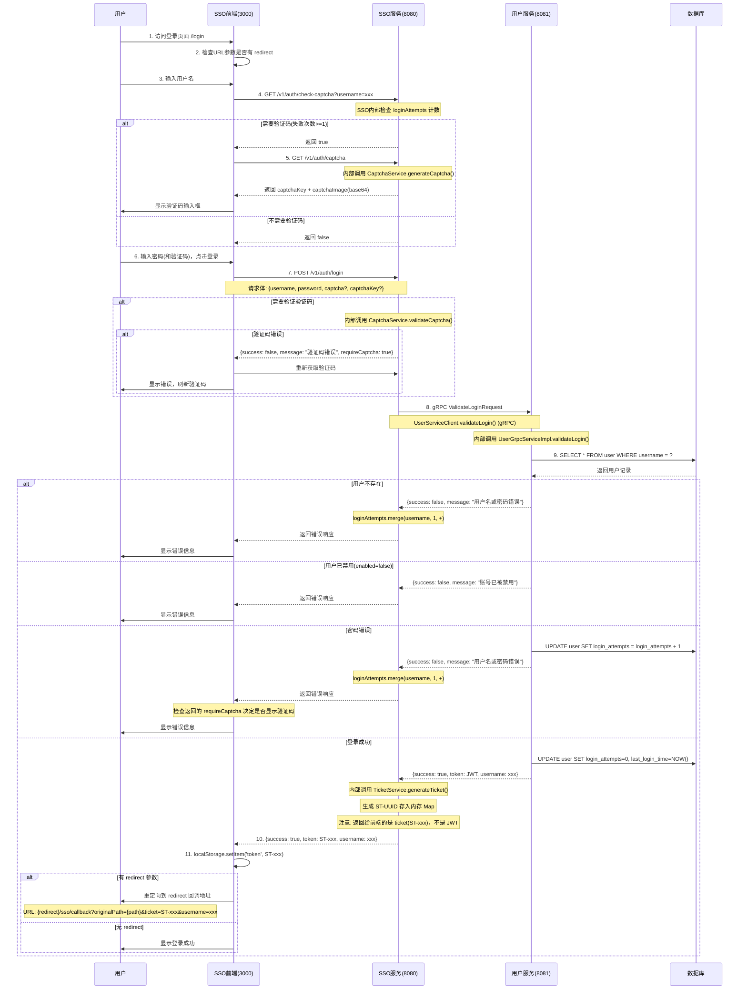
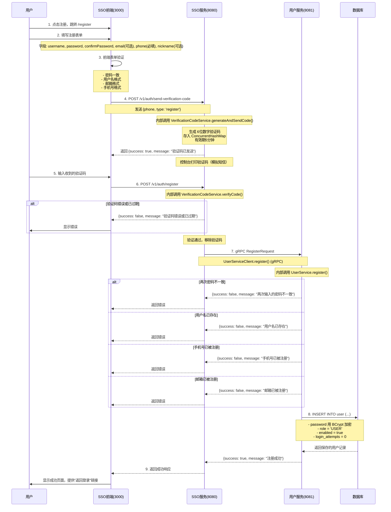
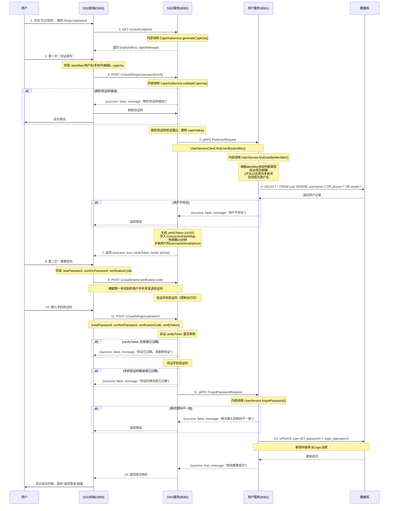
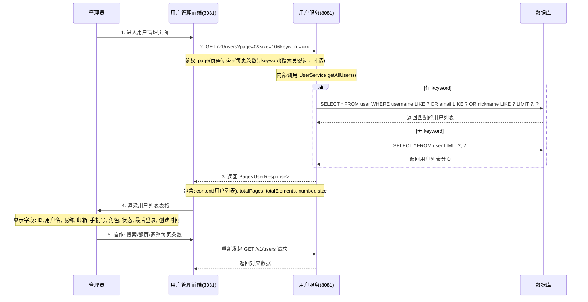
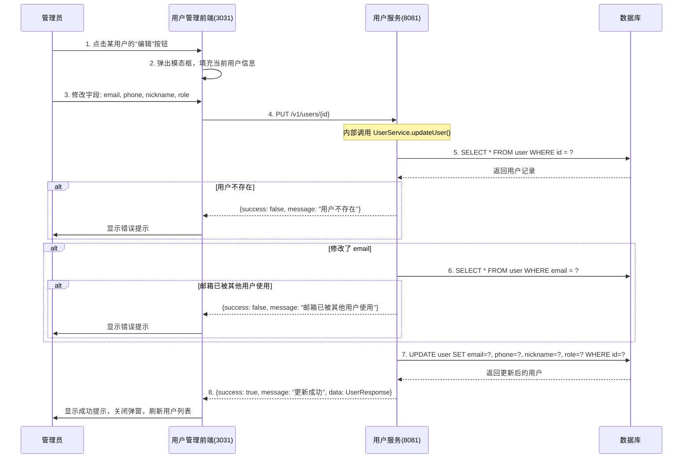
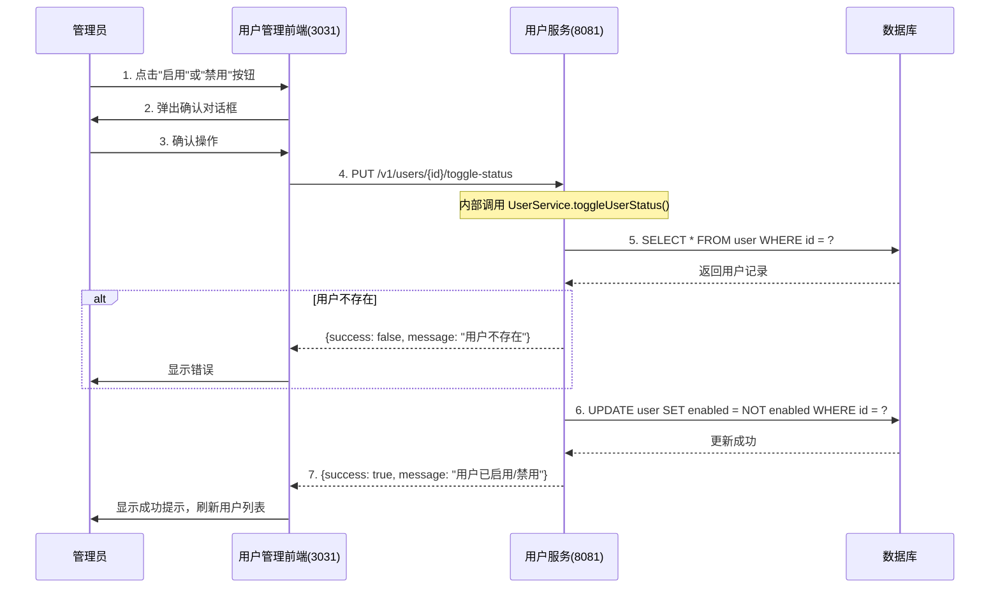
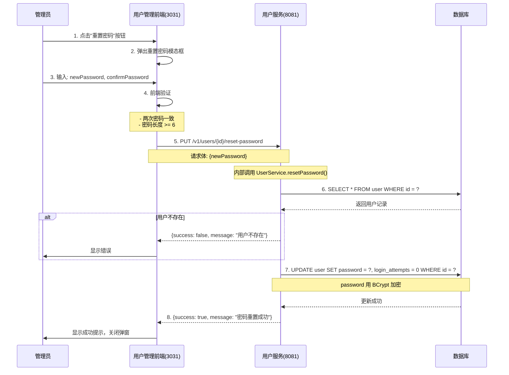
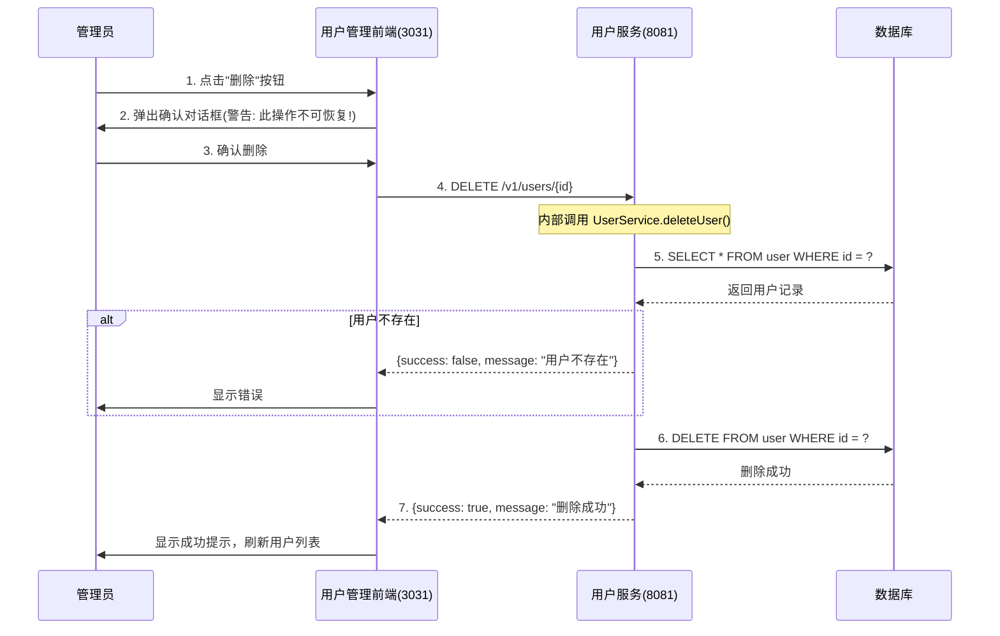
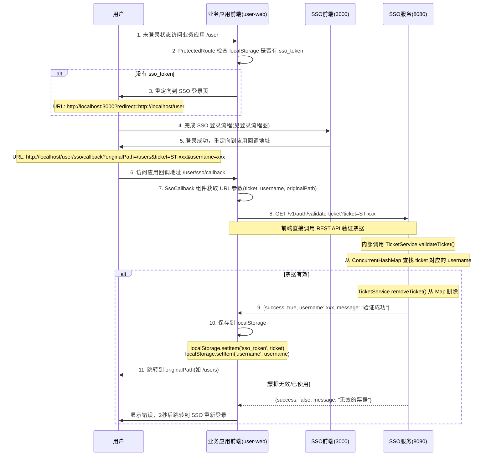
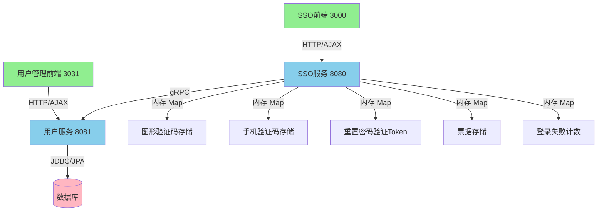

# 业务流程说明

## 一、SSO 登录流程

### 1.1 流程图



### 1.2 核心要点

1. **验证码机制**:
   - CaptchaService 是 sso-server 内部的 Service 类，不是独立服务
   - 验证码存储在 sso-server 内存的 ConcurrentHashMap
   - 验证成功后立即删除 key（一次性使用）

2. **登录失败计数**:
   - sso-server 和 user-server 各维护一份登录失败计数
   - sso-server: ConcurrentHashMap 内存存储
   - user-server: 数据库 user 表的 login_attempts 字段

3. **服务间调用**:
   - sso-server 通过 UserServiceClient + gRPC 调用 user-server
   - gRPC 地址: `static://user-server:9091` (Docker) 或 `static://localhost:9091` (开发环境)

4. **票据机制**:
   - TicketService 是 sso-server 内部的 Service 类
   - 票据格式: `ST-` + UUID
   - 票据存储在 sso-server 内存的 ConcurrentHashMap
   - 票据验证后立即删除（一次性使用）

---

## 二、用户注册流程

### 2.1 流程图



### 2.2 流程特点

- 手机号为必填项，用于接收验证码
- 邮箱为可选项
- 通过手机验证码验证用户身份，防止恶意注册
- 验证码有效期5分钟

---

## 三、忘记密码流程

### 3.1 流程图



### 3.2 流程特点

- 两步式验证，安全性更高
- 第一步只需要输入用户名/手机号/邮箱（三选一）+ 图形验证码
- 后端自动识别用户输入的identifier类型
- 第二步通过手机验证码确保是用户本人操作
- verifyToken 有效期15分钟
- 必须输入两次密码确认，防止输入错误

---

## 四、用户管理流程

### 4.1 用户查询列表流程



### 4.2 编辑用户信息流程



### 4.3 启用/禁用用户流程



### 4.4 管理员重置密码流程



### 4.5 删除用户流程



---

## 五、SSO 票据验证流程



### 5.1 关键实现说明

1. **票据验证是前端直接调用 REST API**
   - 业务应用前端 (user-web) 的 SsoCallback 组件直接调用 `/v1/auth/validate-ticket`
   - 不是后端调用，也不是 gRPC 调用

2. **没有创建应用本地会话**
   - 验证成功后只是将 ticket 保存到 localStorage 的 'sso_token'
   - 没有生成新的 JWT 或 Session
   - 也没有调用 user-server 获取用户详情

3. **会话检查是纯前端实现**
   - ProtectedRoute 组件通过检查 localStorage.getItem('sso_token') 判断是否登录
   - 没有与后端进行会话验证

4. **每个前端应用都需要自己的 callback 路由**
   - user-web 有 `/sso/callback` 路由
   - 新的前端应用也需要实现类似的 SsoCallback 组件

---

## 六、实体与存储关系

```mermaid
erDiagram
    USER {
        Long id PK "主键"
        String username UK "用户名(唯一)"
        String password "BCrypt加密密码"
        String email UK "邮箱(唯一，可为空)"
        String phone "手机号(可为空)"
        String nickname "昵称"
        String avatar "头像URL(可为空)"
        String role "角色: ADMIN / USER"
        Boolean enabled "是否启用: true / false"
        Integer login_attempts "登录失败次数"
        LocalDateTime last_login_time "最后登录时间"
        LocalDateTime created_at "创建时间"
        LocalDateTime updated_at "更新时间"
    }
    
    note left of USER: 数据库持久化存储<br>user-server 维护
    
    CAPTCHA_SSO {
        String key PK "UUID"
        String code "4位验证码"
    }
    
    note right of CAPTCHA_SSO: ConcurrentHashMap 内存存储<br>sso-server 内部 CaptchaService 维护
    
    TICKET_SSO {
        String ticket PK "ST-UUID"
        String username "关联用户名"
    }
    
    note right of TICKET_SSO: ConcurrentHashMap 内存存储<br>sso-server 内部 TicketService 维护
    
    LOGIN_ATTEMPTS_SSO {
        String username PK
        Integer count "失败次数"
    }
    
    note right of LOGIN_ATTEMPTS_SSO: ConcurrentHashMap 内存存储<br>sso-server 内部 AuthService 维护
```

---

## 七、服务间调用关系


