# 业务流程说明

## 重要说明：已完成标准 OAuth2 授权码模式改造

本文档包含**改造前**和**改造后**两套流程说明。当前生产环境使用**标准 OAuth2 授权码模式**。

***

## 一、（改造后）OAuth2 授权码登录流程（当前使用）

### 1.1 整体架构（前后端分离 + 双协议支持）

```
┌──────────────────────────────────────────────────────────────────────────────────────────────────────────┐
│                                            浏览器/客户端                                                  │
│  ┌──────────────────┐                          ┌──────────────────┐                                      │
│  │   user-web       │                          │    sso-web       │                                      │
│  │   (3001)         │                          │    (3000)         │  ← 纯前端登录页面（React）            │
│  │   OAuth2 Client  │                          │    SSO Portal     │                                      │
│  └────────┬─────────┘                          └────────┬─────────┘                                      │
└───────────┼─────────────────────────────────────────────┼──────────────────────────────────────────────────┘
            │                                             │
            │ 1. 未登录访问                               │ 未登录时 Spring Security 302 重定向
            ▼                                             ▼
┌──────────────────────────────────────────────────────────────────────────────────────────────────────────┐
│  sso-server (8080) - OAuth2 授权服务器（纯后端API）                                                      │
│                                                                                                          │
│  ┌──────────────────────────────────────────────────────────────────────────────────────────────────┐   │
│  │  OAuth2 标准 HTTP 端点（第三方应用）                                                                 │   │
│  │  • GET  /oauth2/authorize      - 授权端点（未登录→302→sso-web登录页）                              │   │
│  │  • POST /oauth2/token          - 令牌端点（第三方使用HTTP）                                          │   │
│  │  • GET  /oauth2/jwks           - 公钥端点（公开）                                                    │   │
│  │  • GET  /userinfo              - 用户信息端点                                                         │   │
│  │  • POST /logout                - 登出（销毁Session）                                                 │   │
│  └──────────────────────────────────────────────────────────────────────────────────────────────────┘   │
│                                                                                                          │
│  ┌──────────────────────────────────────────────────────────────────────────────────────────────────┐   │
│  │  内部 gRPC 服务（微服务间调用）                                                                      │   │
│  │  • ExchangeToken     - 授权码换Token（内部服务用gRPC，高性能）                                       │   │
│  │  • ValidateToken     - Token 验证                                                                    │   │
│  │  • RevokeToken       - Token 撤销                                                                    │   │
│  │  • GetClientInfo     - 客户端信息查询                                                                 │   │
│  └──────────────────────────────────────────────────────────────────────────────────────────────────┘   │
│                                                                                                          │
│  ┌──────────────────────────────────────────────────────────────────────────────────────────────────┐   │
│  │  客户端管理（白名单）                                                                               │   │
│  │  • GET/POST/PUT/DELETE /v1/oauth2/clients    - 客户端CRUD                                         │   │
│  │  • GET  /v1/oauth2/clients/validate-redirect  - 回调地址白名单校验                                 │   │
│  │  🔒 安全机制：redirect_uri 必须与注册完全匹配，不支持通配符，防止开放重定向攻击                       │   │
│  └──────────────────────────────────────────────────────────────────────────────────────────────────┘   │
│                                                                                                          │
│  Session: SSO_SESSION Cookie (HttpOnly, SameSite=Lax, 30分钟超时)                                        │
└──────────────────────────────────────────────────────────┬───────────────────────────────────────────────┘
                                                           │
                                                           │ gRPC 调用
                                                           ▼
┌──────────────────────────────────────────────────────────────────────────────────────────────────────────┐
│  user-server (8081) - OAuth2 资源服务器                                                                 │
│                                                                                                          │
│  ┌──────────────────────────────────────────────────────────────────────────────────────────────────┐   │
│  │  Token 交换（双协议支持）                                                                            │   │
│  │  • HTTP: POST /v1/oauth2/token  → 内部调用 sso gRPC → 返回 Token                                     │   │
│  │  • gRPC: 直接调用 SsoService.ExchangeToken                                                          │   │
│  └──────────────────────────────────────────────────────────────────────────────────────────────────┘   │
│                                                                                                          │
│  • JWT Bearer Token 验证 - 所有受保护API（通过 /oauth2/jwks 公钥验签）                                    │
└──────────────────────────────────────────────────────────────────────────────────────────────────────────┘
```

**架构设计原则**:

| 维度      | 策略  | 说明                                               |
| ------- | --- | ------------------------------------------------ |
| **前后端** | 纯分离 | sso-web (React) 纯前端，sso-server 纯后端API，无Thymeleaf |
| **协议**  | 双轨制 | 内部微服务 → gRPC（高性能、强类型）；第三方应用 → HTTP（标准、兼容）        |
| **安全**  | 白名单 | redirect\_uri 严格完全匹配，防止开放重定向攻击                   |

***

### 1.2 详细时序图（前后端交互）

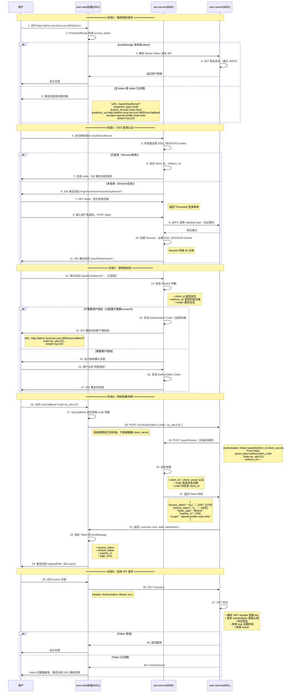

***

### 1.3 核心交互环节说明

#### 🔑 环节1：授权请求构造（user-web 前端）

**代码位置**: [App.js - redirectToSSO](file:///Users/wangbo/Project/data-annotation/zqzl/zqzl-traecn/frontend/apps/user-web/src/App.js#L40-L56)

```javascript
// 构造 OAuth2 授权请求
const params = new URLSearchParams({
  response_type: 'code',           // 授权码模式
  client_id: 'user-web-client',    // 客户端ID
  redirect_uri: 'http://admin.local.bw.com:3002/sso/callback',  // 回调地址
  scope: 'openid profile read write',  // 权限范围
  state: Math.random().toString(36).substring(2, 15)  // CSRF 防护
});
window.location.href = `http://api.local.bw.com:8080/oauth2/authorize?${params}`;
```

**关键参数说明**:

| 参数                   | 作用                  | 示例值                                  |
| -------------------- | ------------------- | ------------------------------------ |
| `response_type=code` | 指定使用授权码模式           | 必填                                   |
| `client_id`          | 客户端标识，必须提前注册        | `user-web-client`                    |
| `redirect_uri`       | 授权成功后回调地址，必须与注册完全一致 | `http://admin.local.bw.com:3002/sso/callback` |
| `scope`              | 请求的权限范围，空格分隔        | `openid profile read write`          |
| `state`              | 随机值，用于 CSRF 防护      | 随机字符串                                |

***

#### 🔑 环节2：SSO 会话认证（sso-server 后端）

**代码位置**: [SecurityConfig.java - 表单登录配置](file:///Users/wangbo/Project/data-annotation/zqzl/zqzl-traecn/backend/services/sso-server/src/main/java/com/sso/config/SecurityConfig.java#L32-L58)

```java
// Session-Cookie 配置
.sessionManagement()
    .sessionCreationPolicy(SessionCreationPolicy.IF_REQUIRED)
    .and()
.formLogin()
    .loginPage("/login")              // 登录页面
    .loginProcessingUrl("/login")     // 表单提交地址
    .defaultSuccessUrl("/oauth2/authorize", true)
    .permitAll()
    .and()
.logout()
    .logoutUrl("/logout")
    .logoutSuccessUrl("/login?logout")
    .invalidateHttpSession(true)
    .deleteCookies("SSO_SESSION")     // 登出删除Cookie
```

**Session Cookie 属性**（配置在 application.yml）:

| 属性       | 值             | 作用             |
| -------- | ------------- | -------------- |
| Name     | `SSO_SESSION` | Cookie 名称      |
| HttpOnly | `true`        | 禁止 JS 读取，防 XSS |
| SameSite | `Lax`         | 防 CSRF         |
| Secure   | `false` (开发)  | HTTPS 传输       |
| Max-Age  | 30分钟          | Session 超时     |

***

#### 🔑 环节3：授权码生成与回调（sso-server OAuth2 端点）

**代码位置**: [AuthorizationServerConfig.java - 授权服务器配置](file:///Users/wangbo/Project/data-annotation/zqzl/zqzl-traecn/backend/services/sso-server/src/main/java/com/sso/config/AuthorizationServerConfig.java)

```java
// 客户端配置
return RegisteredClient.withId(client.getId().toString())
        .clientId(client.getClientId())
        .clientSecret(client.getClientSecret())  // BCrypt 加密存储
        .clientAuthenticationMethod(CLIENT_SECRET_BASIC)  // Basic 认证
        .authorizationGrantType(AUTHORIZATION_CODE)       // 授权码模式
        .authorizationGrantType(REFRESH_TOKEN)            // 刷新令牌
        .redirectUri(client.getRedirectUri())  // 严格匹配
        .scope(client.getScope())
        .tokenSettings(TokenSettings.builder()
                .accessTokenTimeToLive(Duration.ofHours(2))    // Access Token 2小时
                .refreshTokenTimeToLive(Duration.ofDays(30))  // Refresh Token 30天
                .build())
        .build();
```

**安全机制**:

- 授权码（Code）**一次性有效**，使用后立即失效
- 授权码默认有效期 **5分钟**
- 授权码与 client\_id 绑定，不能被其他客户端使用
- redirect\_uri **严格匹配**，不支持通配符

***

#### 🔑 环节4：授权码安全交换（双协议支持）

**协议策略**：

| 使用场景      | 协议       | 优点                |
| --------- | -------- | ----------------- |
| **内部微服务** | **gRPC** | 高性能、强类型、服务治理、链路追踪 |
| **第三方应用** | **HTTP** | 标准兼容、无需SDK、跨语言    |

***

##### 方案A：内部服务 gRPC 调用（推荐）

**代码位置**: [OAuth2GrpcServiceImpl.java - gRPC Token交换](file:///Users/wangbo/Project/data-annotation/zqzl/zqzl-traecn/backend/services/sso-server/src/main/java/com/sso/grpc/OAuth2GrpcServiceImpl.java)

**Proto 定义** ([sso.proto](file:///Users/wangbo/Project/data-annotation/zqzl/zqzl-traecn/backend/services/sso-server/src/main/proto/sso.proto)):

```protobuf
service SsoService {
  rpc ExchangeToken(TokenExchangeRequest) returns (TokenExchangeResponse) {}
  rpc ValidateToken(TokenValidationRequest) returns (TokenValidationResponse) {}
  rpc RevokeToken(RevokeTokenRequest) returns (RevokeTokenResponse) {}
  rpc GetClientInfo(ClientInfoRequest) returns (ClientInfoResponse) {}
}

message TokenExchangeRequest {
  string code = 1;                    
  string client_id = 2;              
  string client_secret = 3;          
  string redirect_uri = 4;           
  string grant_type = 5;             
}
```

**gRPC 服务端实现**:

```java
@Override
public void exchangeToken(TokenExchangeRequest request, 
                          StreamObserver<TokenExchangeResponse> responseObserver) {
    // 1. 验证客户端存在
    Client client = clientRepository.findByClientId(request.getClientId());
    
    // 2. 验证 client_secret（BCrypt 匹配）
    if (!passwordEncoder.matches(request.getClientSecret(), client.getClientSecret())) {
        response.onError("客户端密钥错误");
        return;
    }
    
    // 3. 🔒 白名单校验：redirect_uri 必须完全匹配
    if (!client.getRedirectUri().equals(request.getRedirectUri())) {
        response.onError("回调地址与注册地址不匹配");
        return;
    }
    
    // 4. 调用内部 OAuth2 端点获取 Token
    // ...
    
    responseObserver.onNext(response.build());
    responseObserver.onCompleted();
}
```

***

##### 方案B：第三方 HTTP 调用（OAuth2 标准）

**代码位置**: [OAuth2Controller.java - HTTP Token交换](file:///Users/wangbo/Project/data-annotation/zqzl/zqzl-traecn/backend/services/user-server/src/main/java/com/user/controller/OAuth2Controller.java#L31-L67)

```java
@PostMapping("/token")
public ResponseEntity<Map<String, Object>> exchangeToken(@RequestBody Map<String, String> request) {
    String code = request.get("code");
    
    // Basic Auth: client_id:client_secret
    HttpHeaders headers = new HttpHeaders();
    headers.setBasicAuth(clientId, clientSecret);

    MultiValueMap<String, String> params = new LinkedMultiValueMap<>();
    params.add("grant_type", "authorization_code");
    params.add("code", code);
    params.add("redirect_uri", redirectUri);

    // 调用标准 OAuth2 /oauth2/token 端点
    HttpEntity<MultiValueMap<String, String>> entity = new HttpEntity<>(params, headers);
    ResponseEntity<Map> response = restTemplate.postForEntity(tokenUri, entity, Map.class);
    
    return ResponseEntity.ok(Map.of("success", true, "data", response.getBody()));
}
```

**为什么要经过 user-server 中转？**

1. ✅ **保护 client\_secret**：绝不能暴露给前端
2. ✅ **便于统一管理**：Token 刷新、日志、审计都在后端
3. ✅ **可扩展性**：可添加额外的业务逻辑（如创建本地用户）

***

#### 🔑 环节5：JWT 资源验证（user-server 资源服务器）

**代码位置**: [SecurityConfig.java - OAuth2 资源服务器](file:///Users/wangbo/Project/data-annotation/zqzl/zqzl-traecn/backend/services/user-server/src/main/java/com/user/config/SecurityConfig.java#L32-L50)

```java
@Bean
public SecurityFilterChain filterChain(HttpSecurity http) throws Exception {
    http
        .authorizeRequests()
            .antMatchers("/v1/oauth2/**", "/h2-console/**").permitAll()
            .anyRequest().authenticated()  // 其他所有API需认证
            .and()
        .oauth2ResourceServer()  // 启用 OAuth2 资源服务器
            .jwt();               // 使用 JWT Token
    return http.build();
}

@Bean
public JwtDecoder jwtDecoder() {
    // 从授权服务器获取公钥验证签名
    return NimbusJwtDecoder.withJwkSetUri(jwkSetUri).build();
}
```

**JWT 验证流程**:

1. 请求头携带 `Authorization: Bearer <token>`
2. Spring Security 解析 JWT Header，获取 `kid`（密钥ID）
3. 调用 `GET /oauth2/jwks` 获取 RSA 公钥集合
4. 使用对应公钥验证签名（防篡改）
5. 验证 `exp`（过期时间）、`iss`（发行者）等声明

***

### 1.4 登出流程

```mermaid
sequenceDiagram
    participant U as 用户
    participant UW as user-web前端
    participant SS as sso-server

    U->>UW: 1. 点击"退出登录"
    UW->>UW: 2. 清空 localStorage (token等)
    
    Note right of UW: // 清除所有认证信息
    localStorage.clear();
    
    UW->>U: 3. 重定向到 SSO 登出端点
    Note right of U: URL: http://api.local.bw.com:8080/logout
    
    SS->>SS: 4. 销毁 Session
    Note right of SS: • session.invalidate()<br>• 删除 SSO_SESSION Cookie
    
    SS->>U: 5. 重定向到登录页面
    Note right of U: /login?logout
```

***

### 1.5 Axios 拦截器配置（前端自动处理）

**代码位置**: [App.js - Axios 拦截器](file:///Users/wangbo/Project/data-annotation/zqzl/zqzl-traecn/frontend/apps/user-web/src/App.js#L8-L30)

```javascript
// 请求拦截器：自动添加 Bearer Token
axios.interceptors.request.use(
  (config) => {
    const accessToken = localStorage.getItem('access_token');
    if (accessToken) {
      config.headers.Authorization = `Bearer ${accessToken}`;
    }
    return config;
  }
);

// 响应拦截器：401 自动重定向登录
axios.interceptors.response.use(
  (response) => response,
  async (error) => {
    if (error.response?.status === 401) {
      localStorage.clear();
      redirectToSSO();  // 重新走 OAuth2 流程
    }
    return Promise.reject(error);
  }
);
```

***

## （改造前）SSO 登录流程

### 1.1 流程图

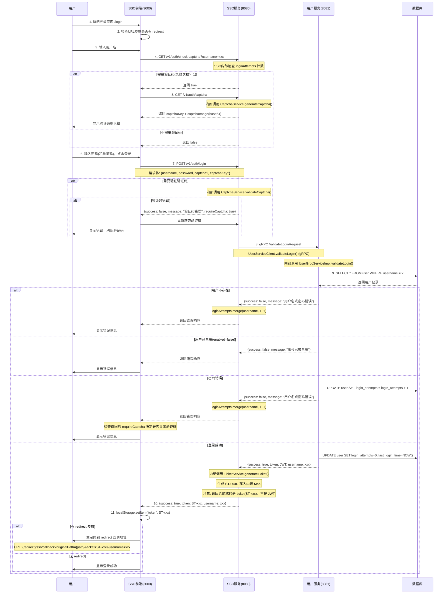

### 1.2 核心要点

1. **验证码机制**:
   - CaptchaService 是 sso-server 内部的 Service 类，不是独立服务
   - 验证码存储在 sso-server 内存的 ConcurrentHashMap
   - 验证成功后立即删除 key（一次性使用）
2. **登录失败计数**:
   - sso-server 和 user-server 各维护一份登录失败计数
   - sso-server: ConcurrentHashMap 内存存储
   - user-server: 数据库 user 表的 login\_attempts 字段
3. **服务间调用**:
   - sso-server 通过 UserServiceClient + gRPC 调用 user-server
   - gRPC 地址: `static://user-server:9091` (Docker) 或 `static://localhost:9091` (开发环境)
4. **票据机制**:
   - TicketService 是 sso-server 内部的 Service 类
   - 票据格式: `ST-` + UUID
   - 票据存储在 sso-server 内存的 ConcurrentHashMap
   - 票据验证后立即删除（一次性使用）

***

## 二、用户注册流程

### 2.1 流程图

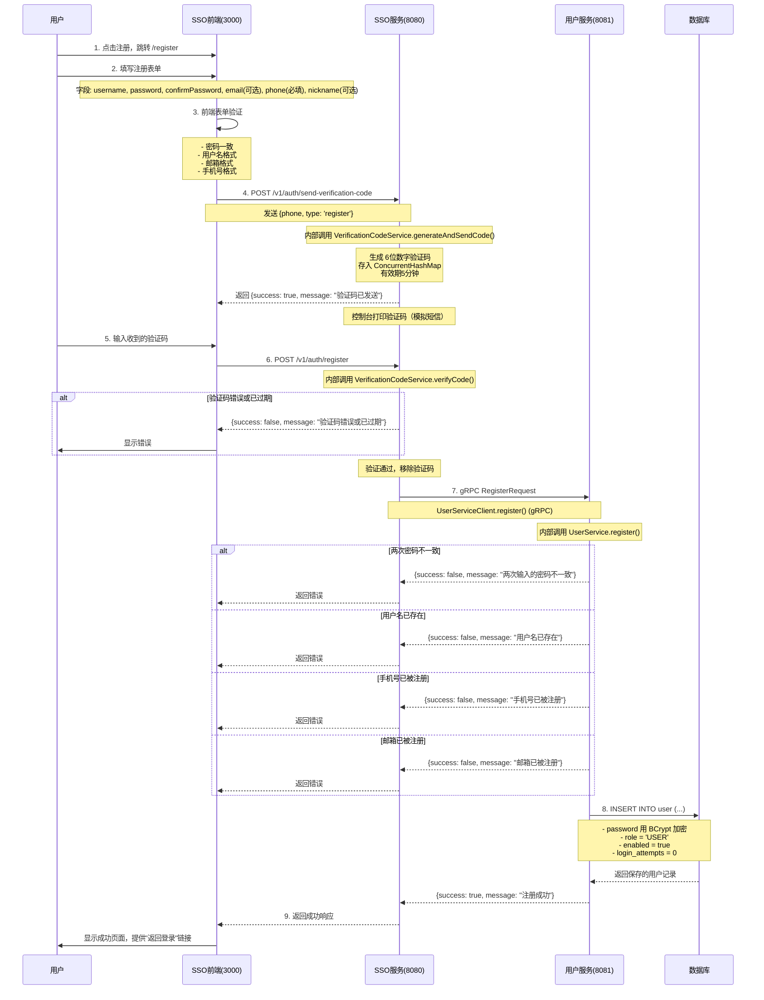

### 2.2 流程特点

- 手机号为必填项，用于接收验证码
- 邮箱为可选项
- 通过手机验证码验证用户身份，防止恶意注册
- 验证码有效期5分钟

***

## 三、忘记密码流程

### 3.1 流程图

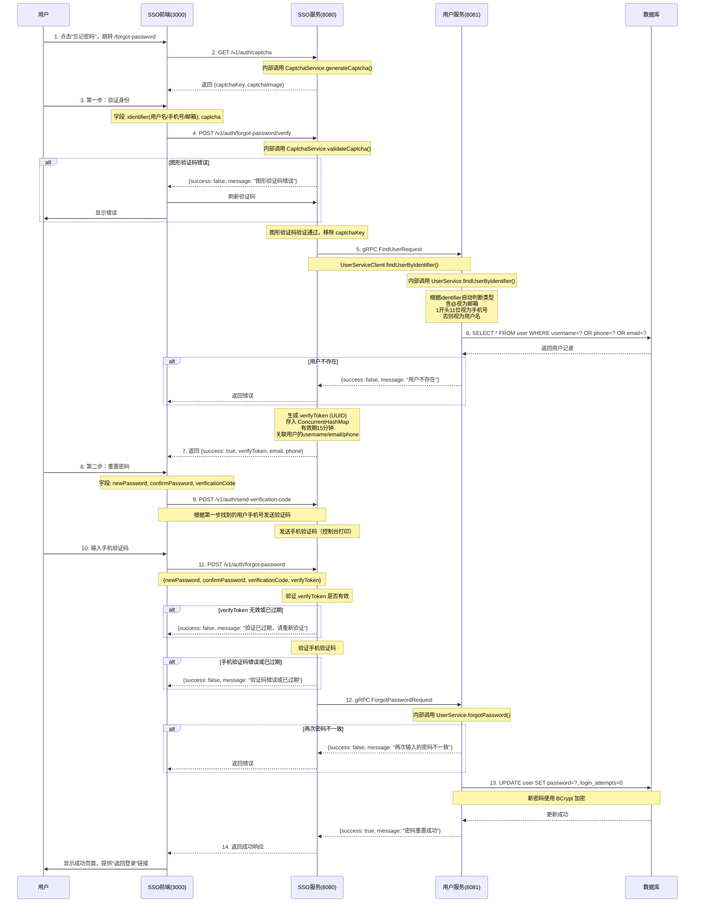

### 3.2 流程特点

- 两步式验证，安全性更高
- 第一步只需要输入用户名/手机号/邮箱（三选一）+ 图形验证码
- 后端自动识别用户输入的identifier类型
- 第二步通过手机验证码确保是用户本人操作
- verifyToken 有效期15分钟
- 必须输入两次密码确认，防止输入错误

***

## 四、用户管理流程

### 4.1 用户查询列表流程

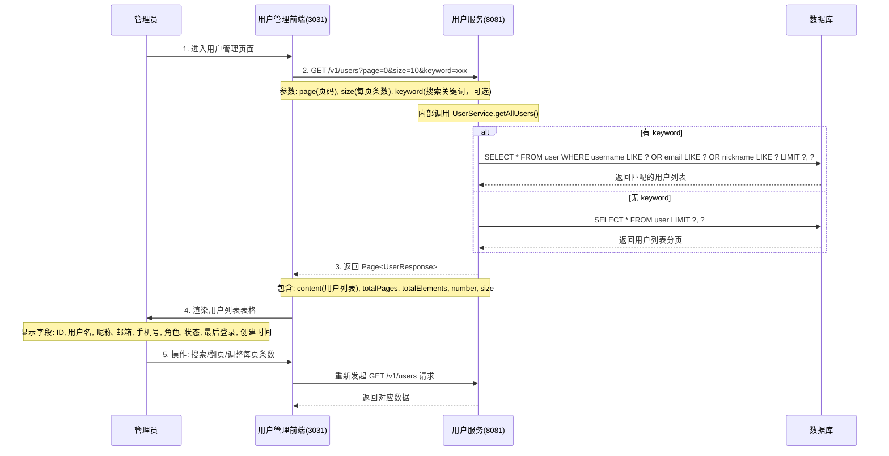

### 4.2 编辑用户信息流程

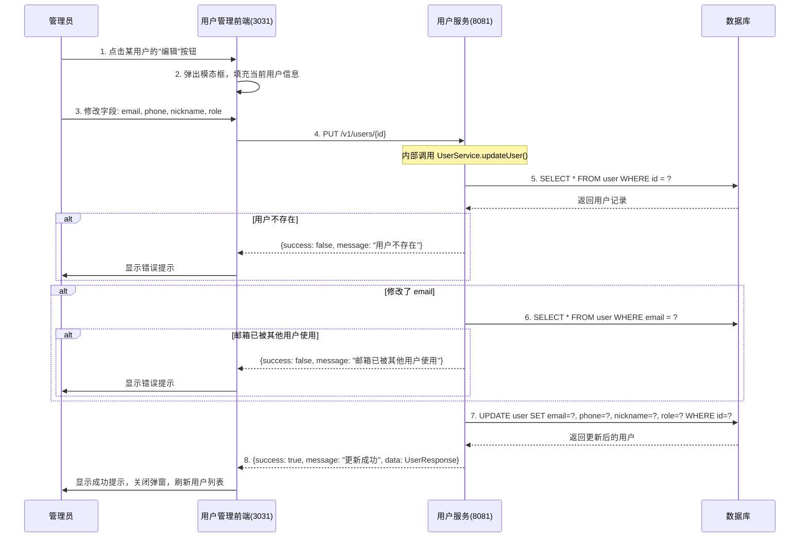

### 4.3 启用/禁用用户流程

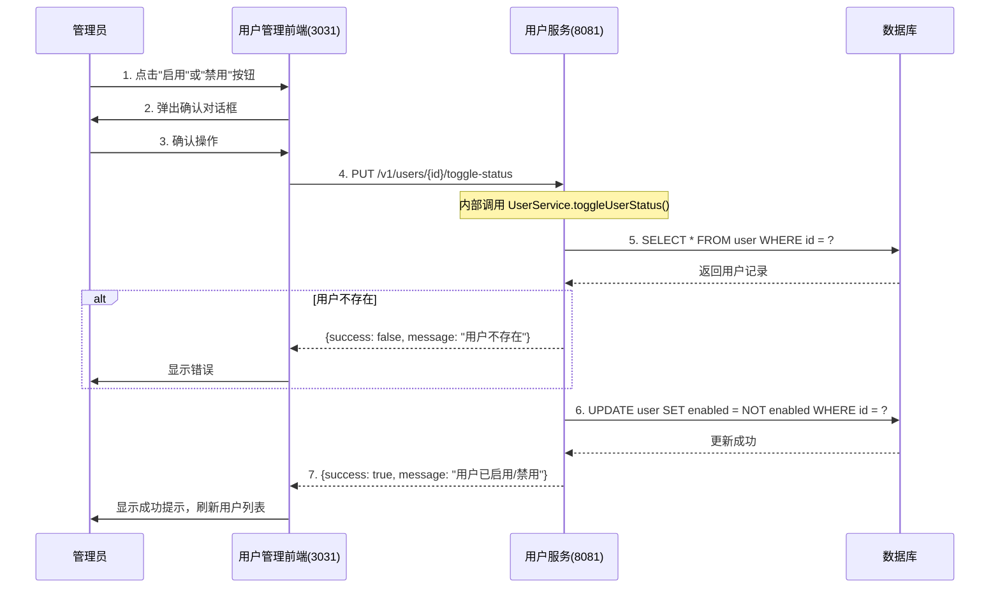

### 4.4 管理员重置密码流程

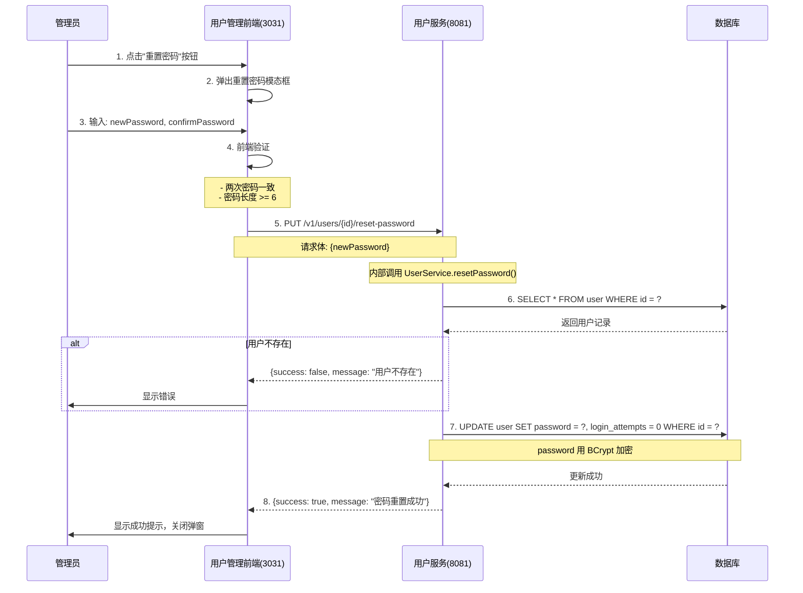

### 4.5 删除用户流程

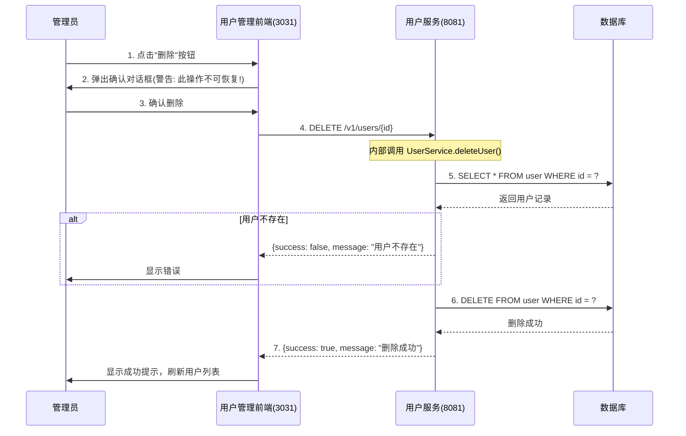

***

## 五、SSO 票据验证流程

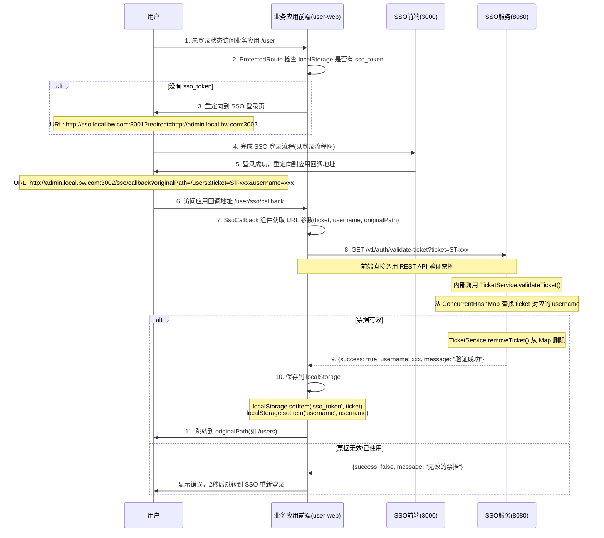

### 5.1 关键实现说明

1. **票据验证是前端直接调用 REST API**
   - 业务应用前端 (user-web) 的 SsoCallback 组件直接调用 `/v1/auth/validate-ticket`
   - 不是后端调用，也不是 gRPC 调用
2. **没有创建应用本地会话**
   - 验证成功后只是将 ticket 保存到 localStorage 的 'sso\_token'
   - 没有生成新的 JWT 或 Session
   - 也没有调用 user-server 获取用户详情
3. **会话检查是纯前端实现**
   - ProtectedRoute 组件通过检查 localStorage.getItem('sso\_token') 判断是否登录
   - 没有与后端进行会话验证
4. **每个前端应用都需要自己的 callback 路由**
   - user-web 有 `/sso/callback` 路由
   - 新的前端应用也需要实现类似的 SsoCallback 组件

***

## 六、实体与存储关系

```mermaid
erDiagram
    USER {
        Long id PK "主键"
        String username UK "用户名(唯一)"
        String password "BCrypt加密密码"
        String email UK "邮箱(唯一，可为空)"
        String phone "手机号(可为空)"
        String nickname "昵称"
        String avatar "头像URL(可为空)"
        String role "角色: ADMIN / USER"
        Boolean enabled "是否启用: true / false"
        Integer login_attempts "登录失败次数"
        LocalDateTime last_login_time "最后登录时间"
        LocalDateTime created_at "创建时间"
        LocalDateTime updated_at "更新时间"
    }
    
    note left of USER: 数据库持久化存储<br>user-server 维护
    
    CAPTCHA_SSO {
        String key PK "UUID"
        String code "4位验证码"
    }
    
    note right of CAPTCHA_SSO: ConcurrentHashMap 内存存储<br>sso-server 内部 CaptchaService 维护
    
    TICKET_SSO {
        String ticket PK "ST-UUID"
        String username "关联用户名"
    }
    
    note right of TICKET_SSO: ConcurrentHashMap 内存存储<br>sso-server 内部 TicketService 维护
    
    LOGIN_ATTEMPTS_SSO {
        String username PK
        Integer count "失败次数"
    }
    
    note right of LOGIN_ATTEMPTS_SSO: ConcurrentHashMap 内存存储<br>sso-server 内部 AuthService 维护
```

***

## 七、服务间调用关系

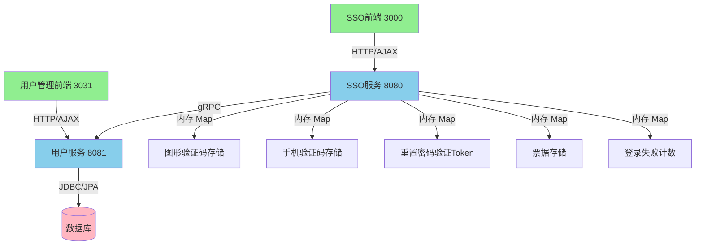

